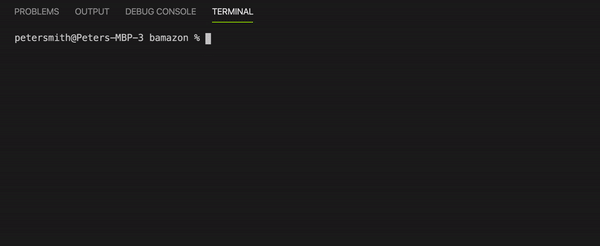

# Bamazon

## Overview
Bamazon is a virtual storefront and inventory tracking/management system for a fictional company. It takes instructions from the Command Line and returns data relative to user input. BamazonCustomer allows customers to view and purchase products. BamazonManager allows managers to query and manipulate inventory.

### Installation
1. Clone the GitHub repository

2. From the Command Line, navigate to bamazon (the LIRI root directory)

3. Install Node.js, which can be found here: https://nodejs.org/en/download/

4. Install the following packages:

* MySQL: https://www.npmjs.com/package/mysql
* Inquirer.js: https://www.npmjs.com/package/inquirer
```
npm install
```

### Using Bamazon
NOTE: You must be in the directory 'bamazon' for Bamazon to work properly.

## Bamazon Customer:


## Bamazon Manager:




### Technologies
- Node.js
- MySQL
- Inquirer.js
